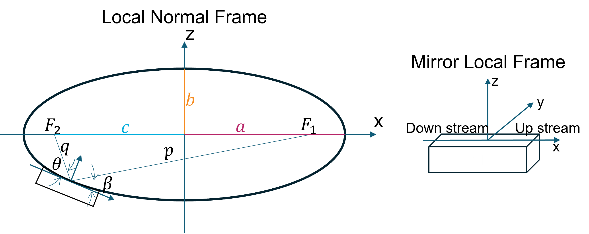
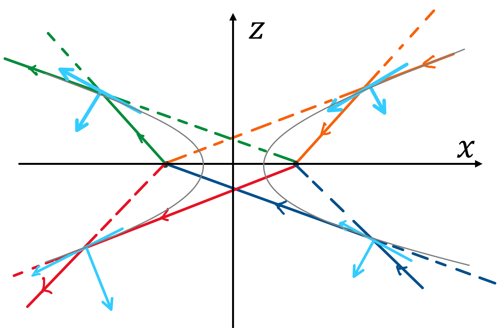

Optical Element
=================

This section provides an overview of the optical elements used in the SRW code, including their definitions and mathematical representations. 

**Ellipsoid**

In SRW, an optical element is dealt with in both the local normal and mirror local coordinate systems, as shown in the figure below. 
All the coordinate system and rotation definitions follow the **right-handed** convention.

An SRW ellipsoid is rotationally symetric with respect to the :math:`x` axis, defined as:

.. math::

    \frac{x^2}{a^2} + \frac{y^2}{b^2} + \frac{z^2}{b^2} = 1

where :math:`F_1` and :math:`F_2` are foci, :math:`a` and :math:`b` are the semi-axes of the ellipsoid; :math:`p` is the object distance, :math:`q` is the image distance, :math:`c` is the focal distance, and we have the relationships:

.. math:: 
    \begin{align}
        a &= \frac{p+q}{2} \\
        b &= \sqrt{a^2 - c^2} \\
        c &= \frac{\sqrt{p^2 + q^2 + 2pq\cos 2\theta}}{2}
    \end{align}

**Hyperboloid**

The hyperboloid is defined by the equation:

